## 🛠️ VisionFerre: E-Commerce Inteligente con IA

  
  &nbsp; &nbsp;
  
  &nbsp; &nbsp;
  

VisionFerre es una ferretería en línea que resuelve el problema de identificar piezas técnicas (tornillería, abrazaderas, anclajes) mediante una imagen, utilizando Inteligencia Artificial.

> **Nota:** Por motivos de optimización de costos en AWS, el modelo de **AWS Rekognition** y el asistente **AWS Bedrock** se encuentran pausados. Si desea una demostración en vivo de las capacidades de IA, no dude en contactarme para activarlos.

 

### 🚀 Características Principales
**Reconocimiento de Imágenes (IA)**: Los usuarios pueden subir una foto de una pieza física y el sistema utiliza **AWS Rekognition (Custom Labels)** para identificarla y mostrar productos coincidentes en el inventario.

**Asistente Inteligente (IA)**: un chatbot brinda detalles de las especificaciones de los productos disponibles en tiempo real con **AWS Bedrock**.

 

### ☁️ Stack Tecnológico

| Tecnología | Uso |
| :--- | :--- |
| **C# / .NET 8 / ADO.NET** | Desarrollo del Backend (Alojado en Railway) |
| **Angular** | Framework para la interfaz de usuario (Alojado en Vercel) | 
| **SQL Server** | Base de datos (Alojada en Somee) |
| **AWS Rekognition (Custom Labels)** | Modelo entrenado con 719 imágenes de piezas de ferretería y 47 etiquetas, con un 93.5% de certeza <kbd>(Actualmente offline para control de costos)</kbd> |
| **AWS Bedrock** | Asistente inteligente que proporciona las especificaciones de los productos disponibles -Modelo *Llama 3.2 1B Instruct*- <kbd> (Disponible bajo solicitud para demostraciones)</kbd> | 
| **AWS S3** | Almacenamiento para las imágenes de los productos |
| **AWS IAM** | Permisos requeridos para acceder a los servicios de AWS desde .NET |
| **Json Web Token** | Autenticación y autorización del usuario |
| **Bootstrap** | Interfaz visual |
| **Arquitectura Multicapa** | 4 capas: API, Lógica, Datos y Entidades |

 

###  🔗 Repositorios del Proyecto

Este repositorio es el backend del proyecto

* 🌐 **Frontend:** [VisionFerre-Frontend](https://github.com/CaritoBA87-tech/VisionFerre-FrontEnd)
* ⚙️ **Backend (API):** [VisionFerre-API](https://github.com/CaritoBA87-tech/VisionFerre-API)
  
 

### 📩 Contacto

**Carolina Bolayna Alvarez** 

*Desarrollador fullstack | AWS Certified Cloud Practitioner*

 

### 📸 Demostración Visual

  <i><b>Página principal</b></i>    
  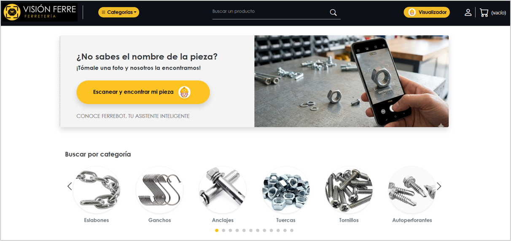  

   <i><b>Navegación por categorías de herramientas</b></i>    
    

   <i><b>Ejemplo de los tornillos autoperforantes</b></i>    
  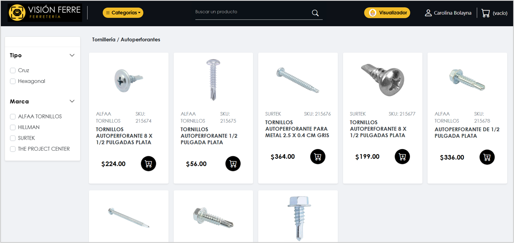  

   <i><b>Filtros para acotar los resultados</b></i>    
  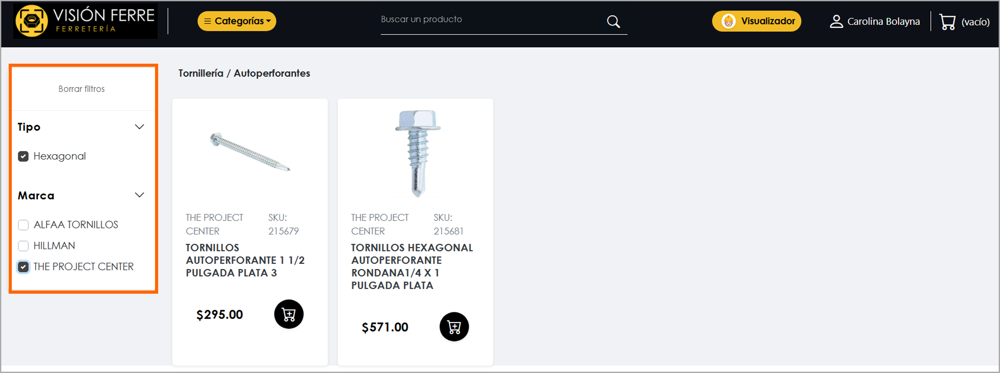  

   <i><b>Detalle del producto</b></i>    
  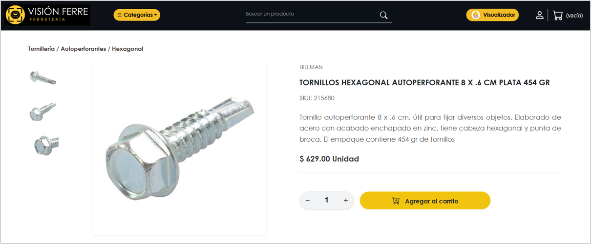  

   <i><b>Asistente inteligente con Amazon Rekognition que reconoce la pieza con base en una imagen proporcionada por el usuario</b> Ejemplo: Tornillo para metal con cabeza de cruz</i>     
  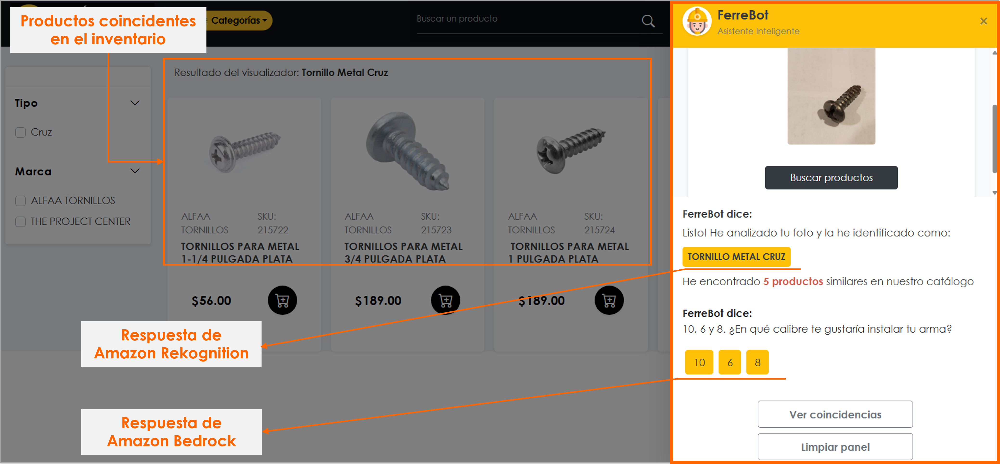  

   <i><b>Asistente inteligente con Amazon Bedrock que pregunta sobre las especificaciones de la pieza buscada</b>  Ejemplo: Tornillo para metal con cabeza de cruz</i>     
  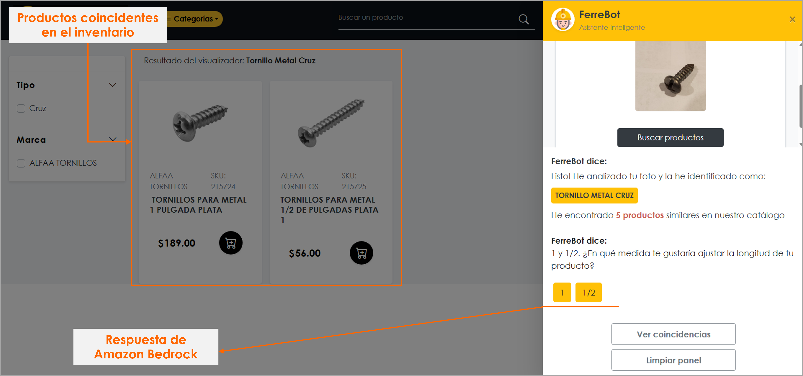  

   <i><b>Asistente inteligente con Amazon Bedrock que pregunta sobre las especificaciones de la pieza buscada</b>  Ejemplo: Tornillo para metal con cabeza de cruz</i>     
  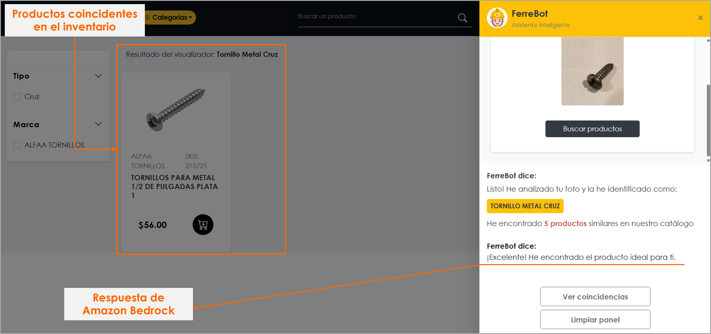  

   <i><b>Asistente inteligente con Amazon Rekognition que reconoce la pieza con base en una imagen proporcionada por el usuario</b>  Ejemplo: Rondana plana</i>     
  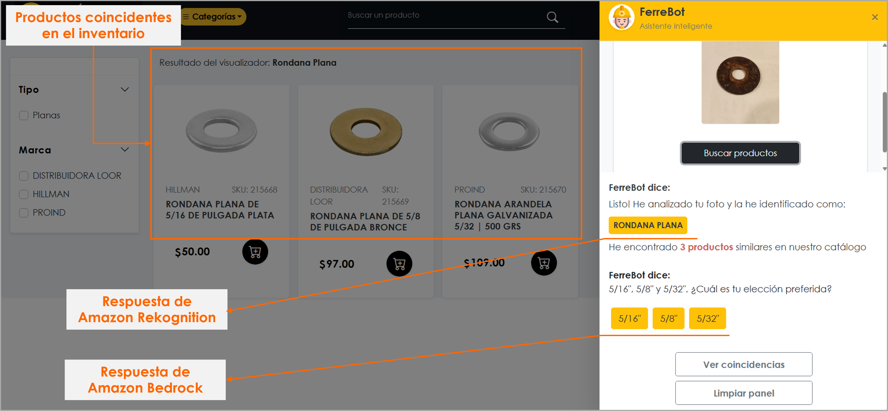  

   <i><b>Asistente inteligente con Amazon Bedrock que pregunta sobre las especificaciones de la pieza buscada</b>  Ejemplo: Rondana plana</i>     
  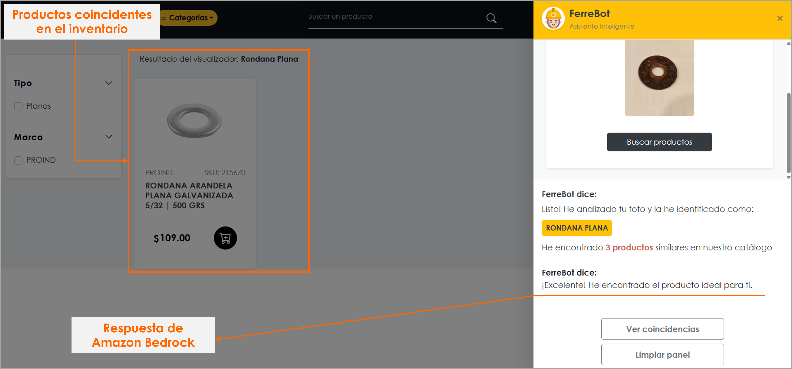  

   <i><b>Carrito de compras que se guarda en el Local Storage del navegador</b></i>     
  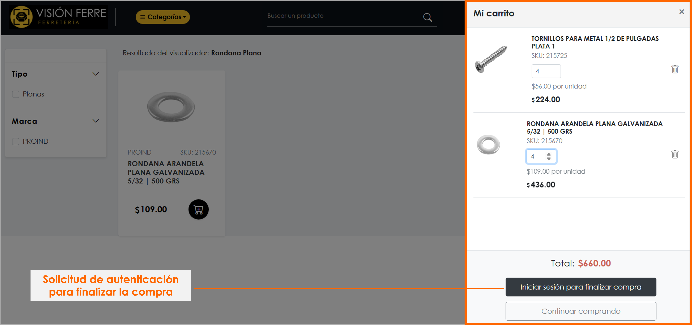  

   <i><b>Autenticación con Json Web Token</b></i>     
  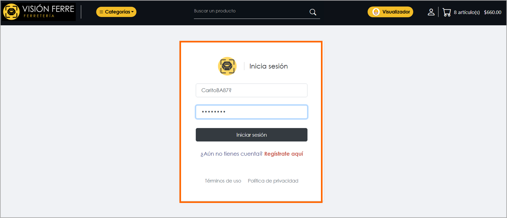  

   <i><b>Generación de cookie de autenticación con Json Web Token</b></i>     
  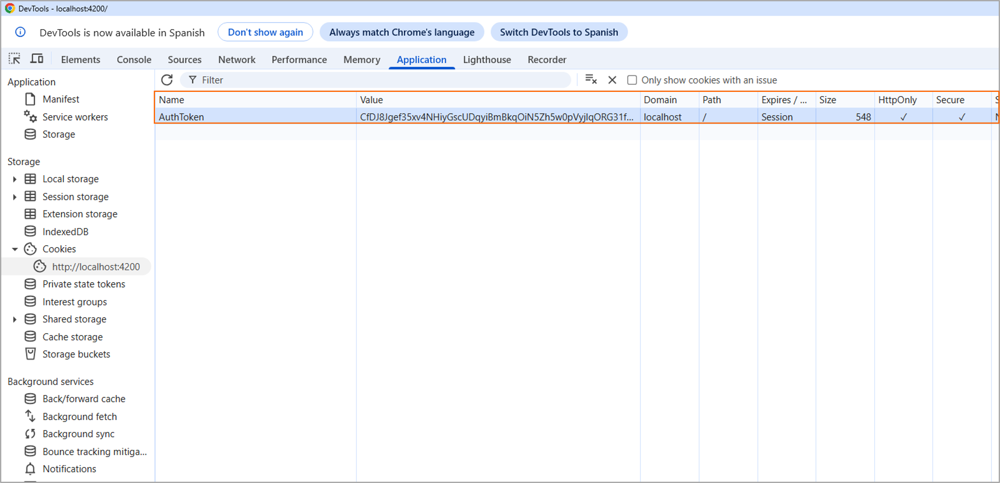  

   <i><b>Usuario autenticado</b></i>     
  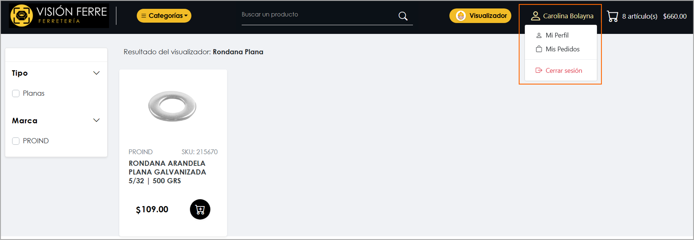  

   <i><b>Finalizar compra</b></i>     
  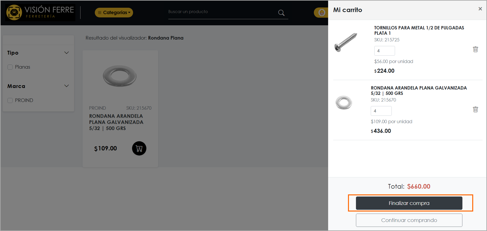  

   <i><b>Compra finalizada</b></i>     
  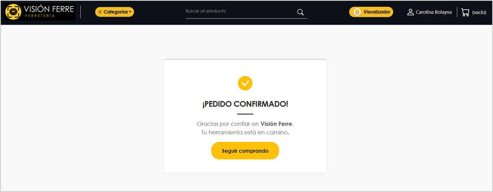  

   <i><b>Otros ejemplos de herramientas que reconoce el modelo de Amazon Rekognition: </b> Tuerca de seguridad</i>     
  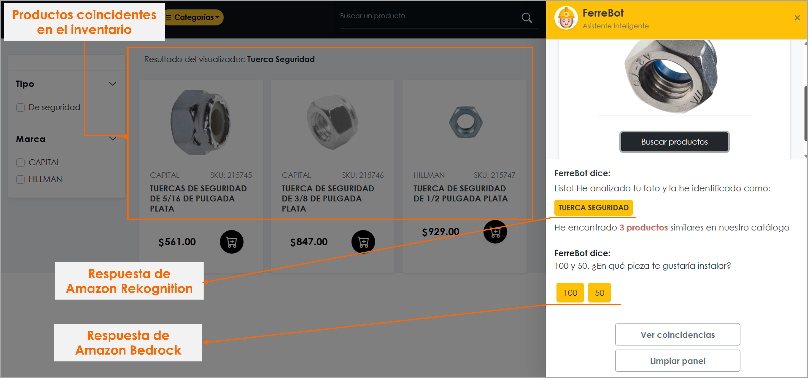  

   <i><b>Otros ejemplos de herramientas que reconoce el modelo de Amazon Rekognition: </b>Armella abierta</i>     
  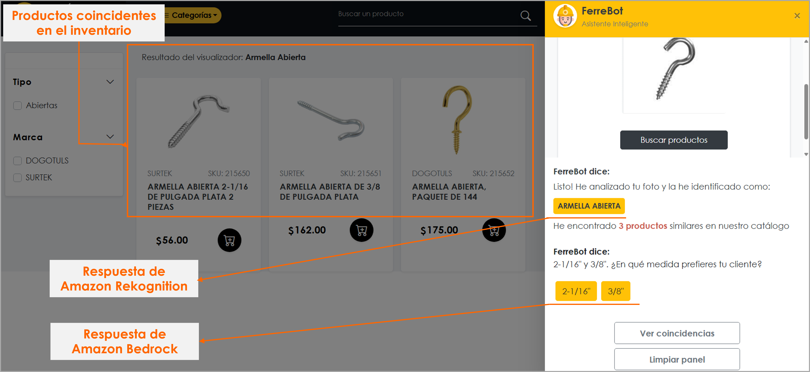  

   <i><b>Otros ejemplos de herramientas que reconoce el modelo de Amazon Rekognition: </b>Chaveta en R</i>     
  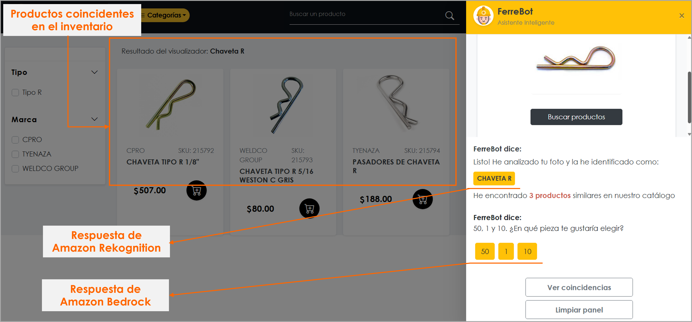  

   <i><b>Otros ejemplos de herramientas que reconoce el modelo de Amazon Rekognition: </b>Alcayata</i>     
  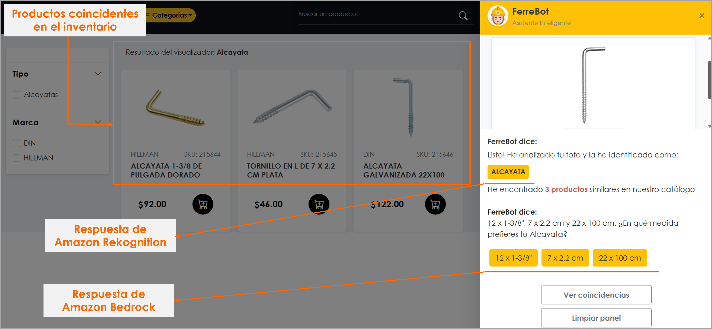  

   <i><b>Otros ejemplos de herramientas que reconoce el modelo de Amazon Rekognition: </b>Tornillo de coche</i>     
  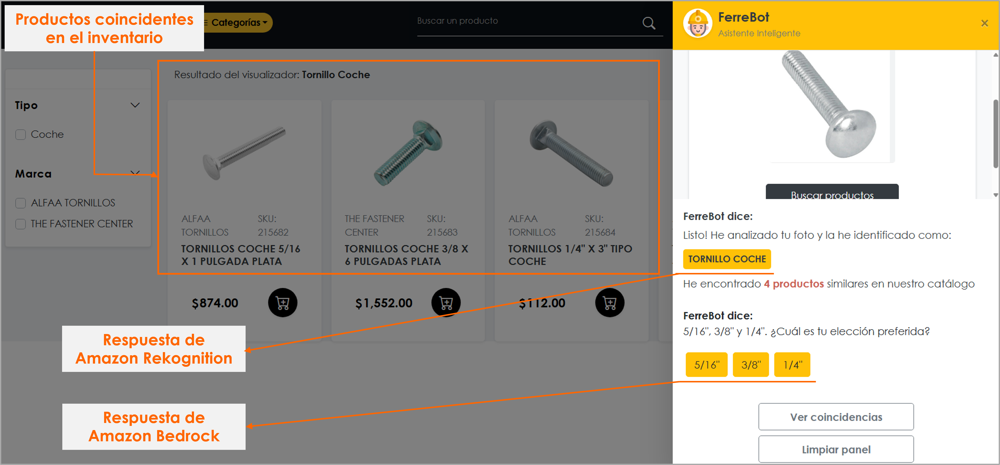  

 

### 📩 Contacto

**Carolina Bolayna Alvarez** 

*Desarrollador fullstack | AWS Certified Cloud Practitioner*

